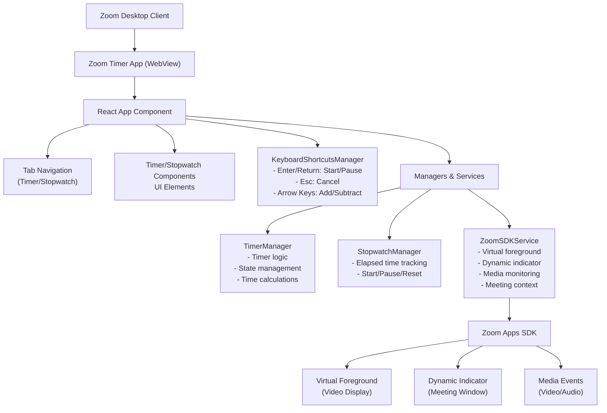
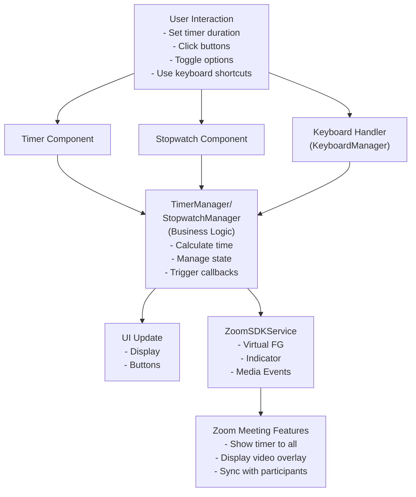
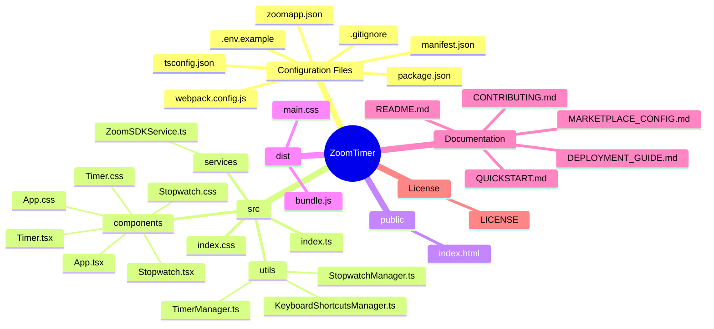
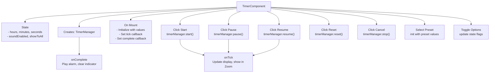
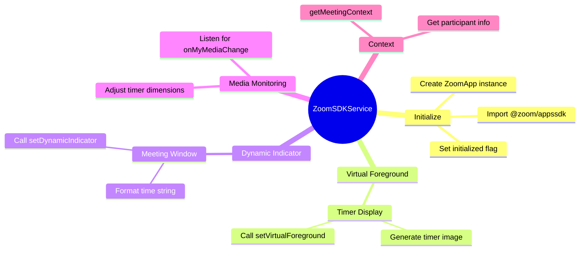
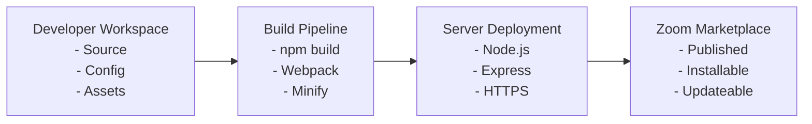
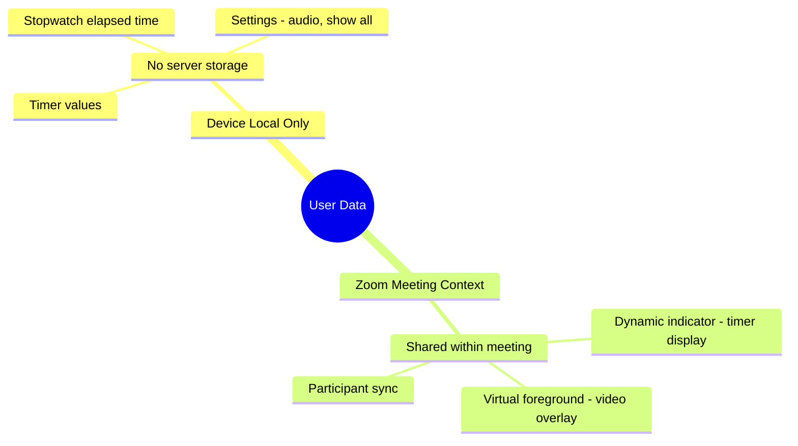

# Zoom Timer App - Project Overview

## 📊 Architecture Diagram

## 🔄 Data Flow

## 🗂️ File Organization

## 🔌 Component Interactions

### Timer Component Flow

### Zoom SDK Integration Flow

## 🎯 Key Features & Implementation

| Feature | Manager | Method | Zoom SDK |
|---------|---------|--------|----------|
| **Timer** | TimerManager | start/pause/resume/stop | - |
| **Stopwatch** | StopwatchManager | start/pause/reset | - |
| **Time Display** | Both | getStatus() | - |
| **Audio Alarm** | Component | playAudio() (Web Audio API) | - |
| **Video Overlay** | ZoomSDKService | setVirtualForeground() | ✓ |
| **Meeting Indicator** | ZoomSDKService | setDynamicIndicator() | ✓ |
| **Keyboard Shortcuts** | KeyboardShortcutsManager | handleKeyDown() | - |
| **Show to All** | Component | UI state flag | ✓ (via indicator) |

## 🚀 Deployment Architecture

## 📈 Performance Considerations

| Aspect | Optimization | Target |
|--------|--------------|--------|
| **Bundle Size** | Webpack minification | < 500KB |
| **Initial Load** | Code splitting | < 2s |
| **Timer Accuracy** | setInterval (1000ms) | ±100ms |
| **UI Responsiveness** | React optimization | 60 FPS |
| **Memory** | Cleanup on unmount | < 50MB |
| **CPU** | Efficient re-renders | Minimal |

## 🔐 Security Model

---

**This architecture ensures:**
✓ Modular, maintainable code
✓ Clean separation of concerns
✓ Easy testing and debugging
✓ Scalable for future enhancements
✓ Secure data handling
✓ Optimal performance
