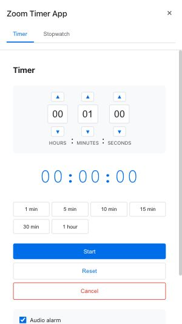
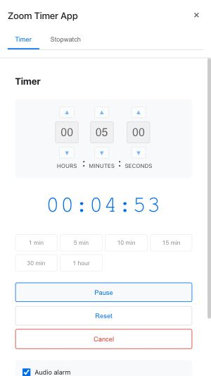
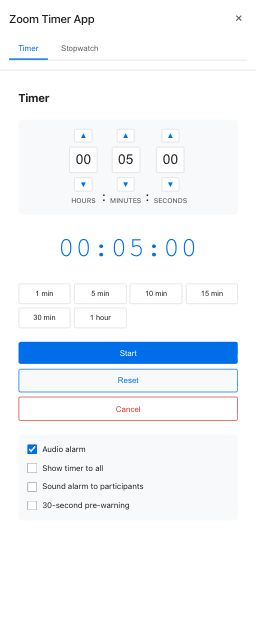
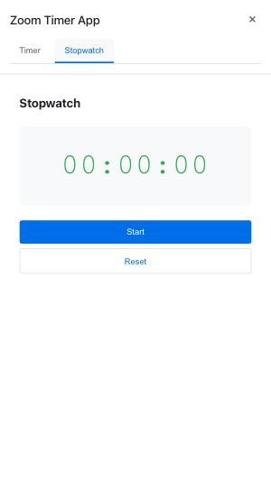
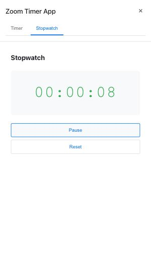

# Zoom Timer App — User Manual

Zoom Timer is a timer and stopwatch that runs inside Zoom meetings. Open it from the Zoom Apps panel and keep everyone on the same schedule — you can even show the countdown on your video tile or sound an alarm for all participants when time is up.

---

## Opening the App

Click the **Apps** button in your Zoom meeting controls and open Zoom Timer. The first time you launch it, Zoom will ask for permission — click **Allow** and the app panel will open right away.

---

## Timer

### Setting the time

When you open the app, the **Timer** tab is shown by default.

Choose how long you want to count down:

- **Quick presets** — Click **1 min**, **5 min**, **10 min**, **15 min**, **30 min**, or **1 hour** to set the time in one click.
- **Custom time** — Use the **+** and **−** arrows next to the hours, minutes, and seconds fields, or click directly into a field and type a number.

When you are ready, click **Start**.

---

### While the timer is running

The remaining time is shown in the centre of the panel. The time fields are locked while the timer is running so you cannot accidentally change the duration. Three buttons are available:

- **Pause** — Freeze the countdown.
- **Reset** — Stop and go back to the time you set.
- **Cancel** — Stop and clear the display entirely.

---

### Pausing and resuming

Click **Pause** to hold the countdown at any point. The remaining time stays frozen on screen. Click **Resume** whenever you are ready to continue.

---

### Timer options

Below the timer controls you will find four checkboxes. Tick the ones you want before you start the timer.

| Option | On by default? | What it does |
|---|---|---|
| **Audio alarm** | Yes | Plays a sound on your device when the timer hits zero. |
| **Show timer to all** | No | Displays the live countdown on your video tile so everyone in the meeting can see it without opening the app. |
| **Sound alarm to participants** | No | Sounds the alarm on the devices of other participants who have the app open, not just yours. |
| **30-second pre-warning** | No | Plays two short beeps on your device 30 seconds before the timer ends — a heads-up that time is nearly up. |

> **Tip** — "Show timer to all" and "Sound alarm to participants" only work while you are in a live Zoom meeting. They have no effect if you open the app outside of Zoom.

---

## Stopwatch

Click the **Stopwatch** tab at the top of the panel to switch modes.

### Starting the stopwatch

The display starts at **00:00:00**. Click **Start** to begin counting up.

---

### While the stopwatch is running

The elapsed time ticks up in hours, minutes, and seconds. Two buttons are available:

- **Pause** — Freeze the display at the current time. Click **Resume** to carry on from where you left off.
- **Reset** — Stop the stopwatch and return it to zero.

---

## Keyboard shortcuts

You can control the timer and stopwatch without touching the mouse:

| Key | Action |
|---|---|
| `Space` | Start, Pause, or Resume |
| `R` | Reset |
| `Escape` | Cancel |

---

## Troubleshooting

**Other participants cannot see the timer on my video.**
This feature requires Zoom desktop v5.14.10 or later. It is not available on the Zoom web client or on older desktop versions. Ask participants to update Zoom if they cannot see the overlay.

**Participants did not hear the alarm.**
The alarm only plays for participants who have the Zoom Timer app open in their own panel. Ask them to open the app before you start the timer.

**The app loaded but some features seem to be missing.**
Your version of Zoom may not support all features. The app will continue working — unsupported features are simply skipped silently. Updating to the latest Zoom desktop client usually resolves this.

**The app showed a loading error or opened in a limited mode.**
If you open the app URL in a web browser instead of inside Zoom, the meeting features (video overlay, participant alarm) will not work. Everything else — timers, stopwatch, audio alarm — works fine in the browser.
